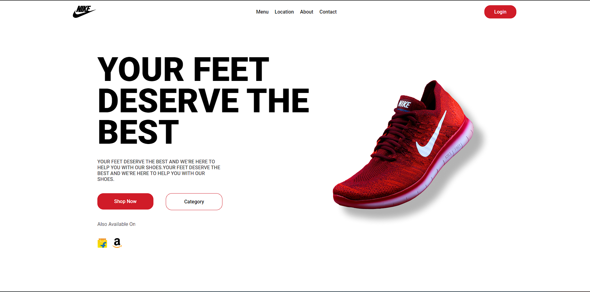

# Brand Page

This project is a simple React application created using Vite. It displays a brand page showcasing basic React setup and styling.

## Project Overview

The application features:
- A brand logo
- Brand name and description
- Basic responsive styling

## Design

Below is the design of the brand page:



## Features

- Displays a brand logo
- Includes brand name and description
- Basic responsive styling

## Installation

To get started with this project, follow these steps:

1. **Clone the Repository:**

   ```bash
   git clone https://github.com/inshirakarim/brand-page.git
   ```

2. **Navigate to the Project Directory:**

   ```bash
   cd brand-page
   ```

3. **Install Dependencies:**

   ```bash
   npm install
   ```

## Usage

To start the development server and view the project in your browser:

1. **Start the Development Server:**

   ```bash
   npm run dev
   ```

2. **Open Your Browser and Go to:**

   ```
   http://localhost:3000
   ```

## Project Structure

- `public/` - Contains static assets including the `images` folder and `index.html`.
- `src/` - Contains source files including React components.
  - `components/` - Contains the following components:
    - `Navbar.jsx` - The navigation bar component.
    - `Content.jsx` - The main content component.
    - `Navbar.css` - CSS file for styling the `Navbar` component.
    - `Content.css` - CSS file for styling the `Content` component.
  - `App.jsx` - The main component that incorporates `Navbar` and `Content`.
- `vite.config.js` - Configuration file for Vite.

## Contributing

Feel free to fork the repository and submit pull requests for improvements or bug fixes.

## Acknowledgments

- Created to demonstrate basic React setup and styling with Vite.
- Design inspiration for the brand page.

